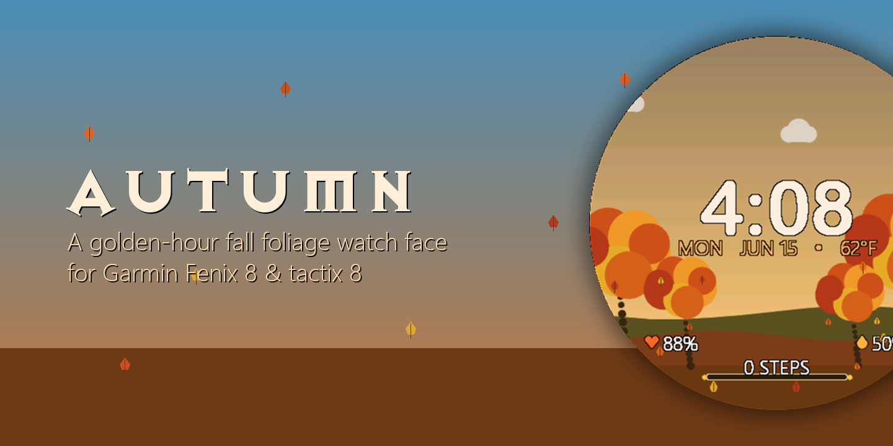
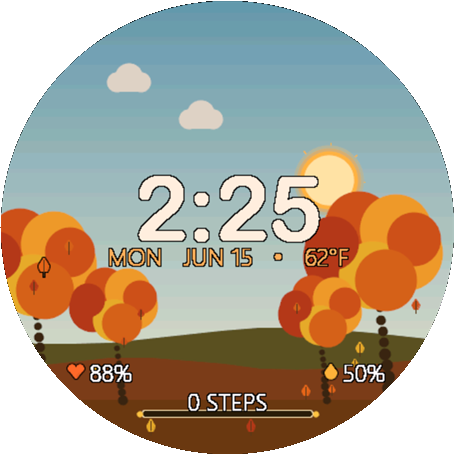
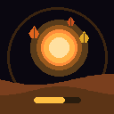
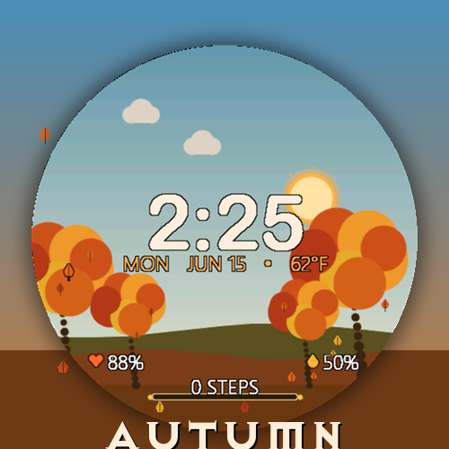

<div align="center">



# 🍂 Autumn Watch Face

**A premium, golden-hour fall-foliage digital watch face for every Garmin Connect IQ 4.0+ round watch.**

Written in [Monkey C](https://developer.garmin.com/connect-iq/monkey-c/) for Connect IQ.

[](LICENSE)
[](https://developer.garmin.com/connect-iq/)
[](#-hardware--scaling)
[](manifest.xml)

</div>

---

<table>
<tr>
<td width="55%" valign="top">

Autumn brings a warm, crisp fall aesthetic to your wrist. Everything is drawn
**procedurally** — a living sky that tracks the time of day, a swaying grove of
maple trees, and leaves that flutter down out of the canopies — all scaled
relative to the screen so it looks right on every supported case size.

- 🌅 **Living sky on real sun times** — dawn purples → crisp midday blue → amber/crimson sunset → starry night, anchored to your actual sunrise/sunset
- ☀️ **Arcing sun & moon** — a glowing harvest sun and a pale crescent moon orbit along the true day arc
- 🌳 **Swaying grove** — deciduous trees with fiery red/orange/gold canopies over a leaf-litter floor
- 🍁 **Falling leaves** — maple leaves spill from each canopy (never from empty sky)
- ⏱️ **Maple-leaf seconds** — a black-outlined leaf orbits the rim *on top of everything*, always legible
- ❤️ **Configurable complications** — pick Heart Rate, Body Battery, Device Battery, Steps, or Calories for each bottom slot
- 🕒 **Big outlined time & date** — high-contrast clock, date, and live weather temperature

</td>
<td width="45%" valign="top" align="center">



<sub><i>Live render on a 454×454 AMOLED panel</i></sub>

</td>
</tr>
</table>

---

## ✨ Features

| | |
|---|---|
| **Living Sky Gradient** | A procedural backdrop that smoothly shifts color by the hour — dawn purples, crisp midday blue, sunset marigold/crimson, and a starry deep night. |
| **Arcing Celestial Objects** | A glowing harvest sun (rotating rays + procedural bloom) and a pale crescent moon rise and set along a circular path. |
| **Drifting Clouds & Rolling Hills** | Muted clouds drift overhead; overlapping olive & burnt-sienna hill layers roll gently along the bottom in active mode. |
| **Swaying Autumn Grove** | A small grove of deciduous trees with fiery canopies sways in the breeze above a leaf-litter forest floor. |
| **Falling Maple Leaves** | Leaves spill out of each tree's canopy and flutter to the ground — they only ever fall from the trees. |
| **Maple Leaf Seconds** | A black-outlined maple-leaf second indicator orbits the perimeter, drawn last so it stays legible on top of the time, date, and complications. |
| **Real Sunrise/Sunset** | The sun, day/night swap, stars, and sky gradient track the actual sunrise/sunset for your location and date (NOAA almanac formula), with a fixed autumn-schedule fallback when there's no location fix. |
| **Configurable Complications** | Each bottom slot is set in app settings — ❤️ Heart Rate, ⚡ Body Battery, 🔋 Device Battery, 👣 Steps, 🔥 Calories, or Off — and draws a matching warm-toned icon. Defaults: left = Heart Rate, right = Device Battery. Plus a 📊 harvest-gold steps bar with live count. |
| **High-Contrast Outlines** | Every text element is drawn with a custom black outline for readability against any dynamic background. |

---

## 📐 Hardware & scaling

Autumn runs on **every Connect IQ 4.0+ round watch that supports watch faces** (~55 products). Square/rectangular panels (Venu Sq 2, Venu X1), Edge bike computers, and handheld GPS units are excluded — the circular layout is built for round screens.

| Family | Examples |
|---|---|
| **Forerunner** | 165, 255 (incl. S / Music), 265 / 265S, 570, 955, 965, 970 |
| **fenix / epix / enduro** | fenix 7 S/X/Pro, fenix 8 (43/47/51mm AMOLED) + Solar, fenix E, epix 2 / Pro (42/47/51mm), enduro 3 |
| **Venu / Vivoactive** | Venu 2 / 2S / 2 Plus, Venu 3 / 3S, Venu 4 (41/45mm), Vivoactive 5 / 6 |
| **Instinct** | Instinct 3 AMOLED (45/50), Instinct 3 Solar 45, Instinct E (40/45), Crossover AMOLED |
| **Specialty** | Approach S50 / S70 (golf), Descent G2 / Mk3 (dive), D2 Air X10 / Mach 1 / Mach 2 (aviation), MARQ 2 / Aviator |

Everything is laid out in percentages of `dc.getWidth()/getHeight()` and the screen center, so it scales cleanly. Bitmap fonts don't scale, so `tools/gen_fonts.py` bakes a correctly-sized Exocet set for **each distinct round resolution** and `monkey.jungle` maps every product to its set:

| Resolution | Font folder | Sample devices |
|---|---|---|
| 454×454 | `resources/fonts` (base) | fenix 8 47/51mm, Pro, fr965/970, venu 3 / 445, epix 2 Pro 51 |
| 416×416 | `resources-round-416x416` | fenix 8 43mm, fr265, fenix E, epix 2, venu 2 |
| 390×390 | `resources-round-390x390` | fr165, venu 3S / 441, vivoactive 5/6, marq 2, instinct 3 AMOLED 45 |
| 360×360 | `resources-round-360x360` | fr265S, venu 2S |
| 280×280 | `resources-round-280x280` | fenix 7X (Pro), fenix 8 Solar 51, enduro 3 |
| 260×260 | `resources-round-260x260` | fr255 / 955, fenix 7 (Pro), fenix 8 Solar 47 |
| 240×240 | `resources-round-240x240` | fenix 7S (Pro) |
| 218×218 | `resources-round-218x218` | fr255S |
| 176×176 | `resources-round-176x176` | instinct 3 Solar 45, instinct E 45 |
| 166×166 | `resources-round-166x166` | instinct E 40 |

---

## 🔋 Always-on display

The face has two render paths sharing one `onUpdate()`:

- **Active mode** — full brightness, animations (rolling hills, swaying grove, falling leaves, sun rotation, drifting clouds), sky gradients, and text outlines.
- **Always-on / low-power** (`mIsSleep`) — burn-in-safe: dim grey time/date, thin outline representations of the battery metrics, steps progress outline, and **no visual fills or background animations**. All lit pixels shift a few pixels each minute (`requiresBurnInProtection`). `onPartialUpdate()` only repaints when the minute changes, staying well inside the always-on power budget.

---

## 📡 Data sources

| Data | API |
|---|---|
| Heart rate | `Activity.getActivityInfo().currentHeartRate`, falling back to `ActivityMonitor.getHeartRateHistory()` — cached ~10s |
| Steps + goal | `ActivityMonitor.getInfo()` (`steps`, `stepGoal`) |
| Calories | `ActivityMonitor.getInfo().calories` |
| Device battery | `System.getSystemStats().battery` |
| Body Battery | `SensorHistory.getBodyBatteryHistory()` — degrades gracefully if unavailable |
| Sunrise / sunset | NOAA almanac formula over the last-known location (`Activity` / `Weather`) — neither powers the GPS |
| Weather | `Weather.getCurrentConditions()` — °C/°F per device settings |

---

## ⚙️ Settings

Editable in Garmin Connect / the simulator's App Settings:

- **Show Date** — toggle the date and weather line.
- **Step Goal Override** — steps for a full harvest bar; `0` uses the watch's own step goal.
- **Bottom-Left Complication** — Heart Rate, Body Battery, Device Battery, Steps, Calories, or Off (default: Heart Rate).
- **Bottom-Right Complication** — same options (default: Device Battery).

---

## 🛠️ Build & run

> **Prerequisites:** the [Connect IQ SDK](https://developer.garmin.com/connect-iq/sdk/) and a JDK. Paths live in `build_config.json` (auto-created on first run) — edit them to match your machine:

```json
{
  "JavaHome": "C:\\Program Files\\Android\\openjdk\\jdk-21.0.8",
  "SdkDir":   "C:\\Users\\<you>\\AppData\\Roaming\\Garmin\\ConnectIQ\\Sdks\\<sdk-version>"
}
```

**Build** (default device = `fenix847mm`, 454×454):

```powershell
./build.ps1                     # build .prg
./build.ps1 -Device fenix843mm  # build the 416×416 variant
./build.ps1 -Export             # package a store-ready .iq
```

**Build + launch in the simulator:**

```powershell
./build.ps1 -Run                # or double-click run_simulator.bat
```

In the simulator, exercise the design via the menus:
- **Settings → Battery** — move the device-battery complication.
- **Simulation → Body Battery** — set the Body Battery percentage.
- **Simulation → Time / Sleep** (Always On) — preview the low-power render path.
- **Simulation → Set Time** — test hour transitions (dawn, midday, sunset, night).

**Sideload to the watch:**

1. Build the `.prg` (or `.iq`).
2. Connect the watch by USB; it mounts as a drive.
3. Copy `bin/Autumn.prg` to `GARMIN/APPS/` on the device.
4. Eject and select **Autumn** from the watch face list.

For store distribution, upload the `.iq` from `./build.ps1 -Export`.

---

## 🔤 Fonts & typography

The face renders using custom rasterized bitmap fonts:

- **Time** — *Arial Rounded MT Bold* (`exocet_time.fnt`/`.png`)
- **Date / metrics** — *Segoe UI Light* (`exocet_label.fnt`/`.png`)

The bitmap-font pipeline:

```
fonts-src/RoundedTime.ttf  ──┐
fonts-src/SegoeUILight.ttf ──┤  python tools/gen_fonts.py
                             └─▶  resources/fonts/exocet_*.fnt + .png
```

- `tools/gen_fonts.py` rasterizes the glyphs we use (digits, `:`, `%`, letters) into alpha atlases so `dc.setColor()` tints them. Re-run it to change sizes or add characters.
- `resources/fonts/fonts.xml` declares `ExocetTime` / `ExocetValue` / `ExocetLabel`.
- `initFonts()` loads them, falling back to vector fonts then built-ins if missing.

---

## 🎨 Assets & customizing

- **Marketing art** (`assets/`) is generated by `tools/gen_assets.py`, which composites the latest `assets/screen_active.png` onto fall-toned backdrops — re-run it after recapturing a screenshot.
- **Colors / palettes** — hill, tree, cloud, leaf, and sky-gradient palettes are the `C_*` constants and functions inside `source/AutumnView.mc`.
- **Layout anchors** — all coordinate scales are relative percentage values in `onUpdate()`.

<div align="center">

| App icon | Cover |
|:---:|:---:|
|  |  |

</div>

---

## 🤝 Contributing

Contributions of all kinds are welcome — see [CONTRIBUTING.md](CONTRIBUTING.md) for setup, coding guidelines, and the PR process. By participating you agree to the [Code of Conduct](CODE_OF_CONDUCT.md).

## 📄 License

Released under the [MIT License](LICENSE). © 2026 Christopher Fennell.

<div align="center"><sub>🍂 Equip Autumn, and take a moment in the crisp fall air.</sub></div>
